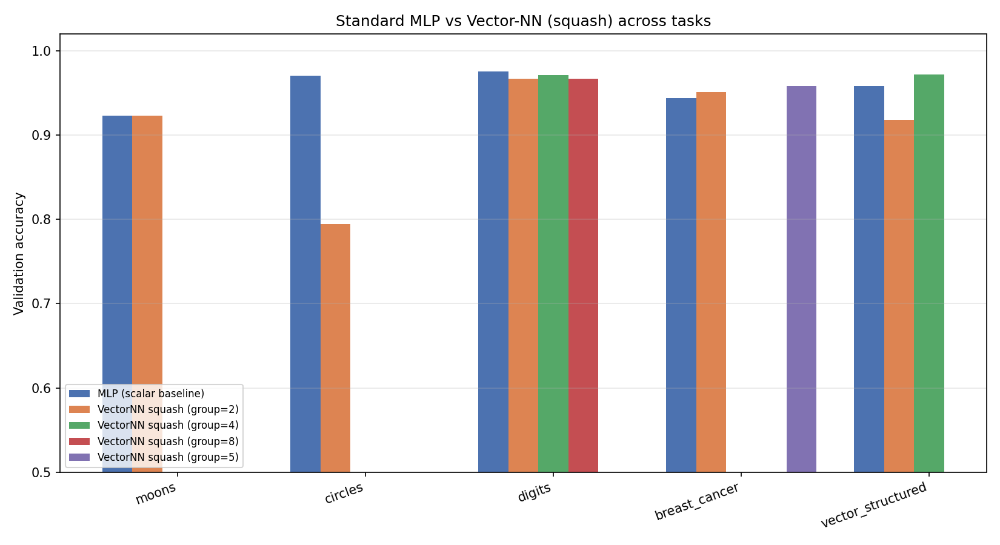
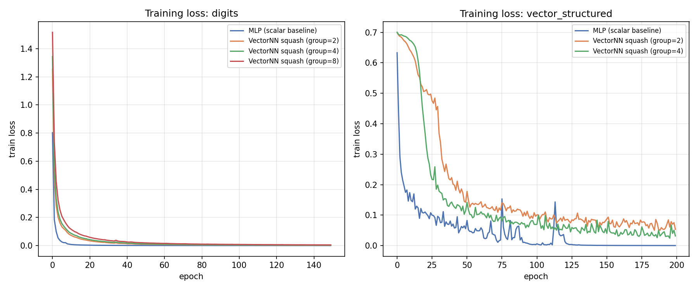
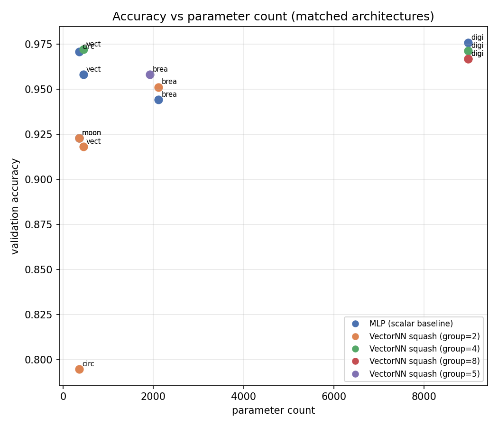

# Vector Neural Networks: does grouping numbers into vectors help?

## What was built

A neural network where each "neuron" holds a small vector (e.g. 2, 4, or 8 numbers)
instead of a single number, connected to other neurons by learned **matrices**
instead of learned scalar weights. Backprop was re-derived by hand for this
setup (not borrowed from a library) and verified against finite-difference
gradient checks to ~1e-8 relative error before any experiment was trusted.

Two versions of the "vector layer" were implemented so the comparison is fair:

- **`elementwise`**: the linear map is grouped into vectors, but the nonlinearity
  (ReLU) is applied to each number independently. This is included as a sanity
  check — it is **mathematically identical** to an ordinary dense layer of the
  same total width. If grouping alone helped, this would show it. It doesn't,
  which is expected and correct: grouping numbers with no group-aware operation
  changes nothing.
- **`squash`**: a capsule-network-style nonlinearity (Sabour, Frosst & Hinton,
  2017) that acts on the *whole vector at once* — it scales a group's vector by
  a function of its length while preserving its direction. This is the only
  place in the design where treating "k numbers together" is actually different
  from treating them as k independent numbers, so this is the one worth testing.

Both were benchmarked against a standard scalar MLP baseline with matched (or
near-matched) parameter counts, across five tasks, at several vector group sizes.

## Results

| Task | MLP (scalar) | Best VectorNN (squash) | Winner |
|---|---|---|---|
| make_moons (2D, noisy) | 0.923 | 0.923 (group=2) | tie |
| make_circles (2D, noisy) | **0.971** (0.966±0.008 over 5 seeds) | 0.795 (**0.641±0.18** over 5 seeds) | MLP, clearly |
| digits (8×8 images, 10 classes) | **0.976** | 0.971 (group=4) | MLP, marginally |
| breast_cancer (30 tabular features) | 0.944 | **0.958** (group=5) | VectorNN, marginally |
| synthetic vector-structured task* | 0.956±0.010 | **0.965±0.006** (group=4) | VectorNN, small but consistent |

*hand-built task where the label genuinely depends on the *length* of paired
input dimensions (rotation-invariant), i.e. designed to be the kind of problem
a vector/norm-based unit should have a native advantage on.

Multi-seed check (5 seeds each) on the two most interesting cases:

- **circles**: MLP 0.966 ± 0.008 vs VectorNN 0.641 ± 0.180 — this is a real,
  reproducible failure mode, not noise. Variance is huge for the vector net;
  it sometimes collapses.
- **vector-structured task**: MLP 0.956 ± 0.010 vs VectorNN 0.965 ± 0.006 —
  small but consistent and low-variance edge for the vector net, on the one
  task literally designed to reward it.

## Honest interpretation

1. **The linear part adds nothing by itself.** Grouping scalars into vectors
   with an elementwise nonlinearity is just a relabeling of an ordinary dense
   layer — confirmed by the `elementwise` sanity check having identical
   gradients/behavior to the MLP baseline. Any real effect has to come from a
   nonlinearity that treats the group as a unit.

2. **A group-aware nonlinearity is a real, different inductive bias — not a
   free upgrade.** The squash nonlinearity forces every group's output to be
   explained by "one direction + one magnitude." That's a *good* fit when the
   data's structure is actually like that (the synthetic task, and apparently
   some of the correlated tabular structure in breast cancer). It's a *bad*
   fit when a task needs independent, un-coupled scalar decisions — `circles`
   needs a radius-threshold decision made independently of a specific
   direction bias baked into training, and the coupling squash imposes across
   the vector actively hurt it, with high run-to-run variance on top.

3. **This is architecture-level capsule networks, not a new capability
   class.** What was built here is a from-scratch, hand-derived version of
   ideas that already exist in the literature (capsule networks). The
   literature's conclusion matches what came out of these experiments:
   real but narrow gains on tasks with genuine part-whole / pose / vector
   structure (their original use case was image viewpoint robustness), and no
   general advantage — sometimes a disadvantage — on generic tabular or
   low-dimensional classification tasks.

4. **On "is this a breakthrough / a step toward superintelligence":** no,
   and I want to be straightforward about that rather than politely dodge it.
   What you built is a legitimate, well-executed variant of an existing
   architecture family, and the experiment was worth running — you now have
   real evidence (not a guess) about where it helps and where it hurts. But
   "does a nonlinearity operate on a group of numbers vs. one number at a
   time" is a fairly narrow architectural choice. It doesn't change what
   kind of problems are learnable, it doesn't touch the training algorithm's
   sample efficiency in a fundamental way, and nothing here suggests emergent
   general capability. Architectural tweaks like this are how the field makes
   steady 1-5% gains on specific problem shapes, which is valuable, but
   "superintelligence" is a claim about a completely different scale of
   thing (general reasoning, planning, autonomy) that this kind of change
   doesn't speak to at all.

## What would be worth trying next, if you want to keep pushing on this

- Test on data that's *really* vector-structured: raw accelerometer/IMU data,
  2D/3D pose keypoints, or image patches (where capsule networks were
  originally tried) rather than tabular data — that's the regime where this
  kind of unit has the best shot at a real edge.
- Try a learned per-group "routing" mechanism (this is what full capsule
  networks add on top of squash — dynamic routing-by-agreement between
  groups) rather than a plain dense linear map between groups.
- If you want to chase "does exotic architecture X help," the efficient way
  is: implement it correctly (gradient-check it, like we did here), define a
  task where the mechanism should matter, and always compare against a
  parameter-matched standard baseline. That's the whole methodology above,
  and it's reusable for the next idea too.

## Files

- `vector_nn.py` — the core implementation (VectorLayer, VectorNN, MLP baseline)
- `gradcheck.py` — finite-difference correctness verification
- `train_utils.py` — training loop
- `experiments.py` — the five benchmark tasks
- `robustness_check.py` — multi-seed variance check
- `make_plots.py` — generates the figures above
